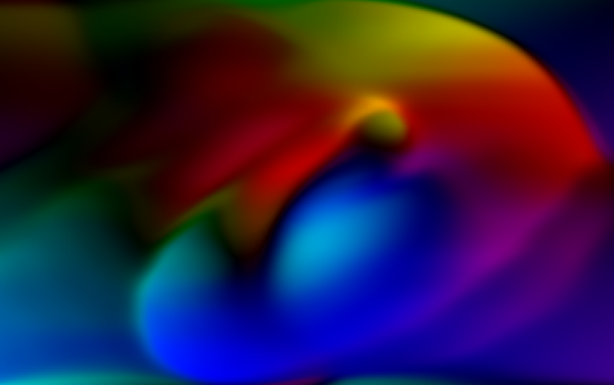

# Stable Fluids 2D

demo: https://yurikasayo.github.io/stable-fluids-2d/

## reference
Real-Time Fluid Dynamics for Games: http://graphics.cs.cmu.edu/nsp/course/15-464/Fall09/papers/StamFluidforGames.pdf